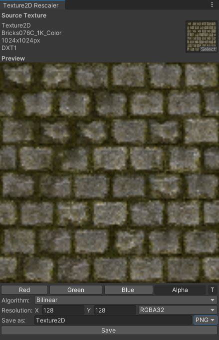
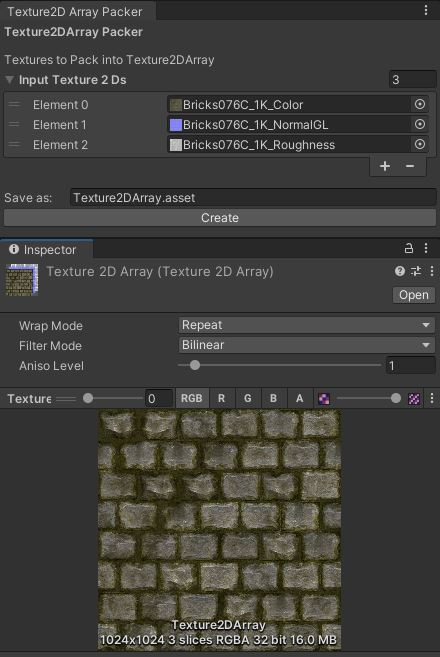

## <b>Included Editor Tools</b>

### <b>Channel Packer</b>

### _Description:_
The Channel-Packer Editor Tool allows you to quickly Pack Color Channel Data from multiply source Textures into a new Texture Asset 
This Tool is Hardware accelerated using a Compute Shader (super duper fast since every pixel works in parallel on its own Thread on the GPU) 
### _Usage_
- Open the Editor Window: (Unity Toolbar) -> Tools -> Texture2D -> Channel Packer  
- In the left "Layer" Scroll-View, add Textures you want to use to create a new Texture Asset 
- Select the Source Textures desired Color Channel & choose the Target Texture Channel popping up below 
- Set Target Texture Resolution, Texture Format and File Format
- Enter Texture Save Path/Name (default "Assets/Texture2D)
- Click "Save" (Use Unity's Texture Import Options for further configuration)
### _Changelog_
- V0.0.1 Alpha: Initial Release
### _Known Issues_
- Limited Format Options
- Doesn't accommodate "User-Error" 
(Source Texture Layer Resolution doesnt rescale to Target Resolution) 
(Errors from mismatching Texture Formats and File Formats aren't cought) 
 

### <b>Texture2D Rescaler</b>

### _Description_
The Texture2D Rescaler Editor Tool allows you rescale Textures with different Algorithms. This Tool is Hardware Accellerated using ComputeShaders. 
### _Usage_
- Open the Editor Window: (Unity Toolbar) -> Tools -> Texture2D -> Rescaler
- In the Source Texture Object Field select a Texture you want to rescale
- Choose a rescaling Algorithm
- Set Target Texture Resolution, Texture Format and File Format
- Enter Texture Save Path/Name (default "Assets/Texture2D)
- Click "Save"
### _Changelog_
- V0.0.1 Alpha: Initial Release
### _Known Issues_
- Yet limited number of Algorithms, more to come & runtime compatibility
- Doesn't accommodate "User-Error"
(Errors from mismatching Texture Formats and File Formats aren't cought) 
 

### <b>Texture2D Array Packer</b>

### _Description_
The Texture2D Array Packer Editor Tool allows you to pack multiple Textures into a Texture2DArray Asset(https://docs.unity3d.com/ScriptReference/Texture2DArray.html). This Type of Asset can be used in Shaders to reference Textures by Index and save Performance on Texture Samples or as a way to pass Data packed into Textures as 2D-Array onto ComputeShaders.
### _Usage_
- Open the Editor Window: (Unity Toolbar) -> Tools -> Texture2D -> Channel Packer
- Add Textures to the Array Dropdown (make sure they have the same Resolution)
- Enter Texture Save Path/Name (default "Assets/Texture2DArray.asset)
- Click "Create"
### _Changelog_
- V0.0.1 Alpha: Initial Release
### _Known Issues_
- Doesn't accommodate "User-Error"
(Source Texture Layer Resolution doesnt rescale to Target Resolution) 
(Errors from mismatching Texture Formats and File Formats aren't cought) 
 