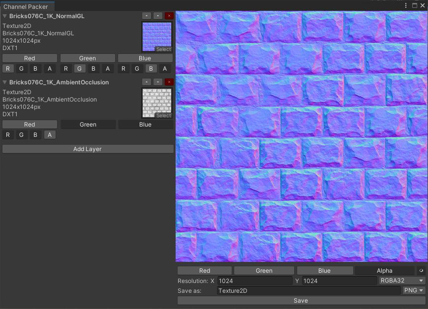

## Included Editor Tools
### Channel Packer

### _Description:_ 
The Channel-Packer Editor Tool allows you to quickly Pack Color Channel Data from multiply source Textures into a new Texture Asset 
This Tool is Hardware accelerated using a Compute Shader (super duper fast since every pixel works in parallel on its own Thread on the GPU) 

 

### <b> _Usage_ </b>
- Open the Editor Window: (Unity Toolbar) -> Tools -> Channel Packer (Texture2D)  
- In the left "Layer" Scroll-View, add Textures you want to use to create a new Texture Asset 
- Select the Source Textures desired Color Channel & choose the Target Texture Channel popping up below 
- Set Target Texture Resolution, Texture Format and File Format
- Enter Texture Save Path/Name (default "Assets/Texture2D)
- Click "Save" (Use Unity's Texture Import Options for further configuration)

### <b> _Changelog_ </b>
- V0.0.1 Alpha: Initial Release

### <b> _Known Issues_ </b>
- Limited Format Options
- Doesn't accommodate "User-Error" 
(Source Texture Layer Resolution doesnt rescale to Target Resolution) 
(Errors from mismatching Texture Formats and File Formats aren't cought) 